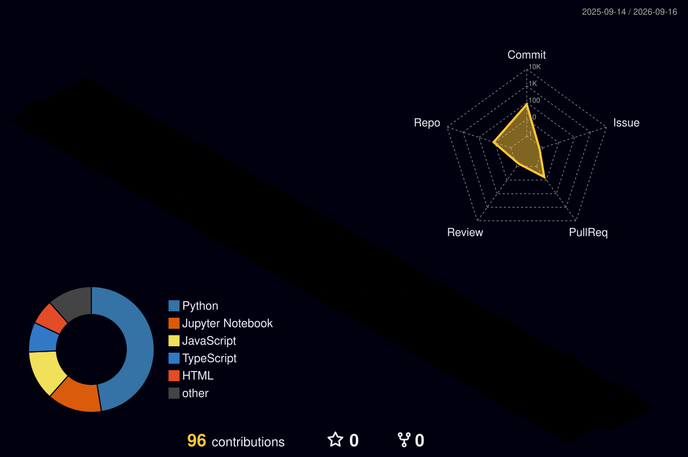

<!-- ══════════════════════════════════════════════════════════════════ -->
<!--  🔥 ULTRA EDITION — personalized for SharafThawfeek                 -->
<!--  Only 2 things left (in "Connect With Me" at the bottom):          -->
<!--    YOUR_LINKEDIN_USERNAME  →  your LinkedIn profile username       -->
<!--    YOUR_EMAIL              →  your email address                   -->
<!--  Requires BOTH workflows: snake.yml + profile-3d.yml               -->
<!-- ══════════════════════════════════════════════════════════════════ -->

<!-- Animated gradient banner with subtitle -->

  

<!-- Typing animation -->

  

<!-- Profile views + focus badges -->

  
  
  
  

 

## 🧑‍💻 About Me

- 🎓 **Data Science undergraduate** at SLIIT (Sri Lanka Institute of Information Technology)
- 🤖 Aspiring **AI Engineer** — building ML models & intelligent systems
- 🔭 Working on projects in **AI, Machine Learning & Data Science**
- 💬 Ask me about **Python, ML, SQL & data analysis**
- ⚡ Fun fact: **I debug with print() and I'm not ashamed**

 

## 🛠️ Tech Arsenal

  

<h4 align="center">👨‍💻 Languages</h4>

  
  
  
  
  
  

<h4 align="center">🤖 AI & Data Science</h4>

  
  
  
  
  
  
  
  

<h4 align="center">🧰 Tools & Platforms</h4>

  
  
  
  
  
  

 

## 📊 GitHub Analytics

  
  

  

 

## 🌟 Profile Summary

  

  
  

  
  

 

## 📈 Contribution Graph

  

 

## 🏆 GitHub Trophies

  

 

## 🐍 Contribution Snake

<!-- Appears after running the snake.yml workflow once -->

  <picture>
    <source media="(prefers-color-scheme: dark)" srcset="https://raw.githubusercontent.com/SharafThawfeek/SharafThawfeek/output/github-contribution-grid-snake-dark.svg"/>
    <source media="(prefers-color-scheme: light)" srcset="https://raw.githubusercontent.com/SharafThawfeek/SharafThawfeek/output/github-contribution-grid-snake.svg"/>
    
  </picture>

 

## 🎮 3D Contribution City

<!-- Appears after running the profile-3d.yml workflow once -->

  

 

## 💭 Daily Dose

  

  

 

## 🤝 Connect With Me

  
  

 

  <i>⭐ Building the future, one dataset at a time.</i>

<!-- Footer wave -->

  

